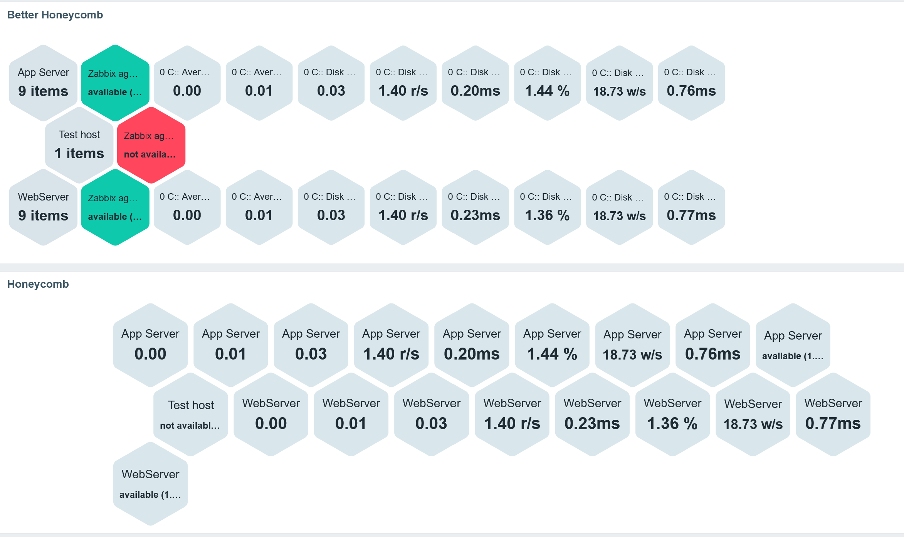

# Better Honeycomb (Zabbix Widget)

An enhanced version of the standard Zabbix Honeycomb widget.

It keeps the original concept, but adds practical features for grouped views, usability, and navigation.

## Comparison

Standard Honeycomb vs Better Honeycomb using the same item pattern:

## Added Features (vs standard widget)

- Grouping modes:
  - `None`
  - `Host`
  - `Host group`
  - `Host group + host`
- Group header honeycomb per group (shows group label + item count).
- Click group header to collapse/expand child honeycombs.
- Optional setting: **Load all groups collapsed**.
- Collapse/expand state is kept in **user session** (browser session storage).
- Optional setting: **Start each group on a new line**.
- Optional setting: **Show all honeycombs (no hiding)** (disables adaptive hiding logic).
- Scrollable widget body when content overflows.
- Auto color by binary value (optional):
  - apply color only when value is exactly `0` or `1`
  - configurable color for `0`
  - configurable color for `1`
- Drill-down on cell click to **Latest data** filtered for the clicked item context.
- Optional setting: open Latest data in same tab or new tab.

## Notes

- The module is implemented as a separate widget with its own manifest ID and namespace:
  - ID: `better-honeycomb`
  - Namespace: `BetterHoneycomb`
- The widget is designed to be a drop-in operational alternative to the standard Honeycomb, especially when many items must be displayed and grouped.

